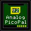

# ∀2 Retro Computing Analog VGA Card & PicoPal

This repo is now an archival copy.
Firmware development will continue to take place in [analog-firmware](https://github.com/V2RetroComputing/analog-firmware)
Hardware development will continue in a new repo shortly.

This is a fork of Mark Aikens [Apple II VGA](https://github.com/markadev/AppleII-VGA/) project with a new board design,
custom logic in an PAL16V8 to handle card select lines, and upgraded firmware with many new features.

Full details are available at [∀2 Retro Computing](https://www.v2retrocomputing.com/).

